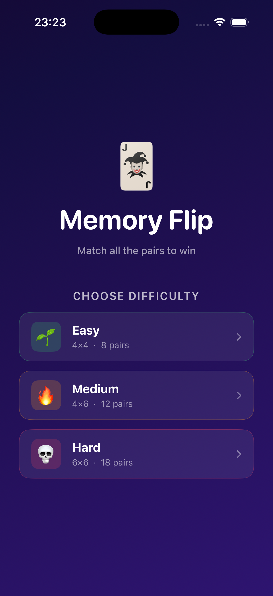
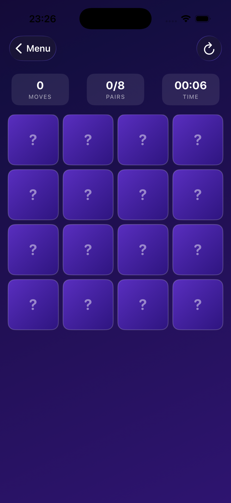
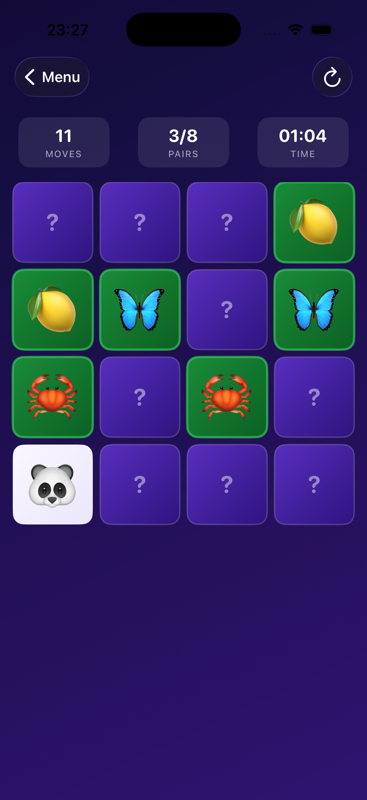
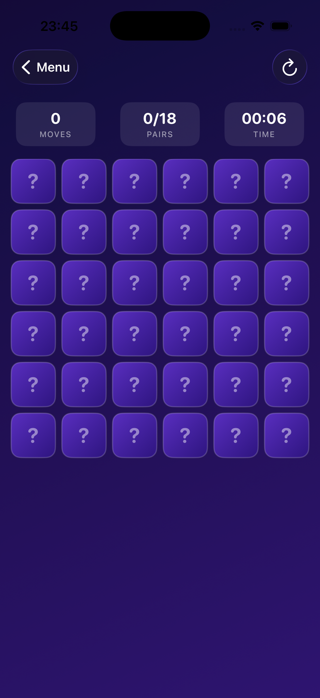
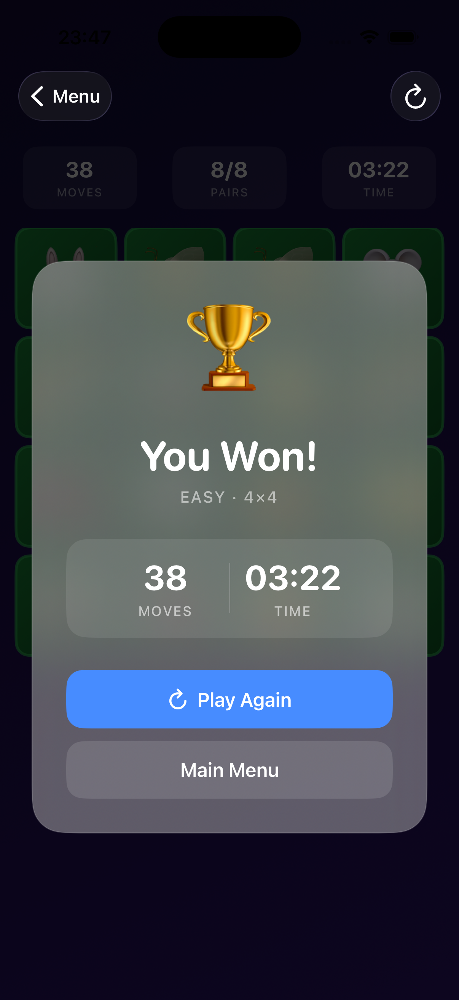

# Memory Flip

A card flip memory game — available as a browser app and a native iOS app.

---

## iOS App

A native SwiftUI port for iPhone, built on the same game mechanics as the web version.

### Screenshots

  
  
  
  
  

### Features

- 3 difficulty levels — Easy (4×4 · 8 pairs), Medium (4×6 · 12 pairs), Hard (6×6 · 18 pairs)
- 3D spring-animated card flips
- Live move counter, pair tracker, and timer
- Win overlay with final moves and time
- 32 unique emoji symbols — animals, nature, and food
- Requires iOS 16+

### How to Run

1. Open `MemoryFlip.xcodeproj` in Xcode
2. Select an iPhone simulator or device
3. Press **Run** (⌘R)

No additional dependencies or configuration needed.

---

## Web Version

A browser-based version — no install, no build step, just open in a browser.

### How to Play

1. Open `memory-game.html` in any modern browser
2. Click a card to flip it, then click a second card
3. If both cards show the same emoji, they stay revealed
4. If they don't match, they flip back — remember where they were!
5. Find all pairs to win

### Features

- 3 difficulty levels: Easy (4×4), Medium (6×4), Hard (6×6)
- 3D card flip animations with hover preview
- Live move counter, match tracker, and timer
- Win screen showing your final score
- 32 unique emoji symbols across animals, nature, and food

### Running Locally

No server required. Just open the file:

- **Double-click** `memory-game.html` in File Explorer, or
- **From WSL/terminal:** `explorer.exe "C:\path\to\memory-game.html"`
